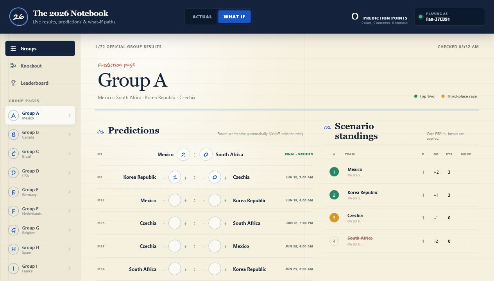

# The 2026 Notebook

A live FIFA World Cup 2026 results, prediction, and what-if notebook inspired
by the handwritten group tables and knockout simulations I kept during Qatar
2022.

**Live product:** [muzzammilminhas.github.io/the-2026-notebook](https://muzzammilminhas.github.io/the-2026-notebook/)



## Product Overview

The app combines an automated official-results notebook with a personal
tournament simulator:

- **Actual:** read-only chronological fixtures and FIFA-sourced results.
- **What If:** score predictions for future group matches with live scenario
  standings beside the fixture feed.
- **Standings:** all 12 official group tables and the best third-place ranking.
- **Knockout:** separate official and personal Round of 32-to-final brackets.
- **Leaderboard:** public rankings using automatically scored predictions.
- **Match centre:** clickable fixture cards with live minute, venue, weather,
  referee, attendance, events, lineups, and team statistics when FIFA publishes
  them.
- **Community picks:** predictions remain private before kickoff and become
  visible after they are locked, including aggregate outcomes and popular
  scorelines.
- **Accounts:** email/password authentication keeps predictions, points,
  nickname, and favourite team synchronized across devices.
- **Admin status:** the owner account can open a private sync-health dashboard
  for FIFA worker status, match counts, prediction totals, and recent failures.
- **Installable PWA:** Chrome and supported mobile browsers can install the
  website as a standalone app with its own icon.

## Prediction Rules

### Group Stage

| Result | Points |
| --- | ---: |
| Exact score | 3 |
| Correct win/draw/loss outcome | 1 |
| Wrong outcome | 0 |

### Knockout Stage

| Result | Points |
| --- | ---: |
| Correct advancing team | 2 |
| Wrong team | 0 |

Predictions are editable only before kickoff. The deadline is enforced in
Postgres using server time and the official kickoff timestamp, so changing a
device clock or bypassing the UI cannot submit a late prediction.

When a match starts, its real score replaces the user's prediction throughout
the scenario calculation as soon as official data is available.

## Live Data Architecture

The app uses two FIFA-hosted data paths:

### 1. Central Official Result Sync

```text
Supabase Cron (every minute)
        |
        v
sync-results Edge Function
        |
        v
FIFA tournament calendar endpoint
        |
        v
Validation + team mapping + normalization
        |
        v
Supabase Postgres matches table
        |
        v
Scoring triggers + React clients
```

The Edge Function downloads the complete 104-match competition feed every
minute. It validates the fixture count and known FIFA fixture IDs before
upserting kickoff times, teams, match status, scores, winners, verification
state, and source metadata.

Official results are cached in Postgres so every visitor reads the same
authoritative tournament state instead of independently polling the complete
FIFA schedule.

### 2. On-Demand Match Details

The browser requests match-specific FIFA endpoints only when needed:

- The live endpoint supplies match minute, teams, venue, weather, officials,
  attendance, events, and lineups.
- The timeline endpoint is a fallback for the live minute.
- FIFA's match-statistics endpoint supplies possession, expected goals,
  attempts, passes, cards, and related statistics.

Live matches refresh once per minute while their details are open. Finished
match details are cached in the browser session.

This is a **near-live polling system**, not a zero-latency WebSocket feed. Under
normal conditions, official score changes appear within roughly one to two
minutes.

## Reliability and Data Integrity

- The result worker expects exactly 104 tournament fixtures and fails safely if
  the response is incomplete.
- Duplicate syncs within 45 seconds are skipped.
- Every sync attempt is recorded in `result_sync_runs`.
- Changes to an already verified result are audited in `result_corrections`.
- Only finished FIFA results are marked verified.
- Prediction scoring runs inside Postgres after a verified result update.
- The previous stored result remains available if FIFA is temporarily
  unreachable.
- The frontend displays unavailable states instead of fabricating missing
  match details.

The main result source is:

```text
https://api.fifa.com/api/v3/calendar/matches
```

These are FIFA-hosted endpoints, but this independent hobby project has no
contractual API or uptime agreement with FIFA.

## Authentication and Security

Supabase Auth provides email/password accounts. A database trigger creates the
user's profile and leaderboard row after signup.

Row Level Security and database triggers enforce the important rules:

- Users can create and update only their own predictions.
- Group and knockout predictions are rejected after kickoff.
- Knockout picks must belong to the actual simulated matchup.
- Later knockout picks are cleared when an earlier path changes.
- Future community predictions cannot be read by other users.
- Locked predictions become public only after kickoff.
- Community grades remain hidden until the result is finished and verified.
- Users cannot directly assign themselves prediction points.
- The browser contains only a Supabase publishable key; the service-role key
  remains inside the Edge Function environment.
- The scheduled worker is protected by a secret stored through Supabase Vault.
- Admin health data is gated by an `admin_users` table and RLS, not by a
  hardcoded frontend password.

## What-If Tournament Engine

The client-side tournament engine handles:

- All 12 groups and 72 group-stage matches.
- Wins, draws, losses, goals for, goals against, goal difference, and points.
- Core FIFA group ranking metrics and mini-table handling for tied teams.
- Ranking the 12 third-place teams and selecting the best eight.
- Official Annex C third-place routing into the Round of 32.
- The complete Round of 32, Round of 16, quarterfinal, semifinal, and final
  paths.
- Dependency cleanup when an earlier knockout winner changes.
- Comparison between official and simulated group positions.

## Database Model

| Table / View | Purpose |
| --- | --- |
| `teams` | Team names, groups, and aliases for FIFA name matching |
| `matches` | All 104 official fixtures, scores, status, winner, and source data |
| `profiles` | Public nickname, avatar seed, and favourite team |
| `predictions` | Group-stage score predictions and scoring results |
| `knockout_predictions` | Predicted knockout winners and scoring results |
| `leaderboard` | Precalculated user totals and scoring breakdown |
| `result_sync_runs` | Result-worker execution history |
| `result_corrections` | Audit history for corrected verified results |
| `public_leaderboard` | Safe public leaderboard projection |
| `community_match_predictions` | Safe post-kickoff community prediction data |
| `community_prediction_scores` | Aggregated post-kickoff scoreline counts |
| `admin_users` | Owner-only admin marker used by RLS for health access |

## Technology Stack

- React 19
- Vite 8
- Supabase Postgres
- Supabase email/password Auth
- Supabase Row Level Security
- Supabase Edge Functions
- Supabase Cron, Vault, and `pg_net`
- Vitest
- ESLint
- GitHub Actions
- GitHub Pages
- Web App Manifest and service worker

No paid sports API, advertising, payment flow, or third-party analytics SDK is
used.

## Project Structure

```text
src/
  components/                  UI screens and reusable components
  data/                        Tournament teams, fixtures, and Annex C routes
  hooks/useWorldCupBackend.js  Auth, Supabase reads/writes, and refresh loop
  lib/matchDetails.js          FIFA match-centre data normalization
  lib/tournamentEngine.js      Standings and knockout simulation

supabase/
  functions/sync-results/      Central FIFA result synchronization worker
  migrations/                  Schema, RLS, triggers, Cron, and scoring logic

public/
  icons/                       PWA and install icons
  manifest.webmanifest         Installable app metadata
  sw.js                        Network-first service worker

.github/workflows/deploy.yml   Test, build, and GitHub Pages deployment
```

For a detailed backend walkthrough and presentation preparation, open
[`PROJECT_VIVA_GUIDE.html`](PROJECT_VIVA_GUIDE.html).

## Local Development

Requirements:

- Node.js 22 or a compatible current Node.js release
- npm

```powershell
npm install
npm run dev
```

The repository includes the production Supabase URL and publishable key as
frontend-safe fallbacks. A different Supabase project can be selected locally:

```powershell
$env:VITE_SUPABASE_URL="https://your-project.supabase.co"
$env:VITE_SUPABASE_PUBLISHABLE_KEY="sb_publishable_..."
npm run dev
```

Database and Edge Function development requires the Supabase CLI and an
appropriately configured Supabase project.

## Verification

```powershell
npm run test
npm run lint
npm run build
```

The current automated suite covers fixture scheduling, tournament calculations,
knockout behavior, FIFA match-detail normalization, and live clock handling.

## Deployment

Every push to `main` starts the GitHub Pages workflow:

1. Install locked npm dependencies.
2. Run tests.
3. Run ESLint.
4. Create the Vite production build.
5. Publish `dist/` to GitHub Pages.

Supabase runs independently from GitHub Pages, so the centralized result sync
continues even when no visitor has the website open.

## Tournament Reference

Tournament routing is based on the official
[FIFA World Cup 2026 Regulations](https://digitalhub.fifa.com/m/636f5c9c6f29771f/original/FWC2026_regulations_EN.pdf).

## Disclaimer

This is an independent, non-commercial fan project. It is not affiliated with,
endorsed by, or operated by FIFA.
